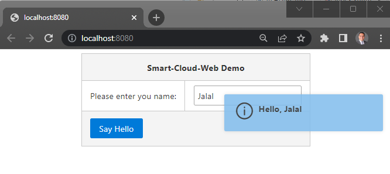

# JKFramework-Web Simple Example
_Last updated: 2022-11-26_

This repository contains a _JKFramework-Web_ that prepare full Faces apps with zero configuration.

## Prerequisites:
- JDK 17+ Installed

## Usage:
1. Clone the repository
2. Import as Java project into your favorite IDE (`We use SpringToolSuite and Eclipse for Java EE developers`)
3. Run `App` class.

## Project Main Contents 
The repository  contains the following main contents: 
1. Maven project with [pom.xml](pom.xml)
  > :page_facing_up:*Note*: If you are using Eclipse, be sure to refresh your project (select your project→ right click→ Maven→ Update Project)
2. [Faces Controller](src/main/java/com/app/Controller.java) 
7. [Faces View](src/main/webapp/index.xhtml)   
8. [Main java class](src/main/java/com/app/App.java)  

## Screenshots
Thats it, now run your App class, in few seconds your browser will open and you should see something like this:

